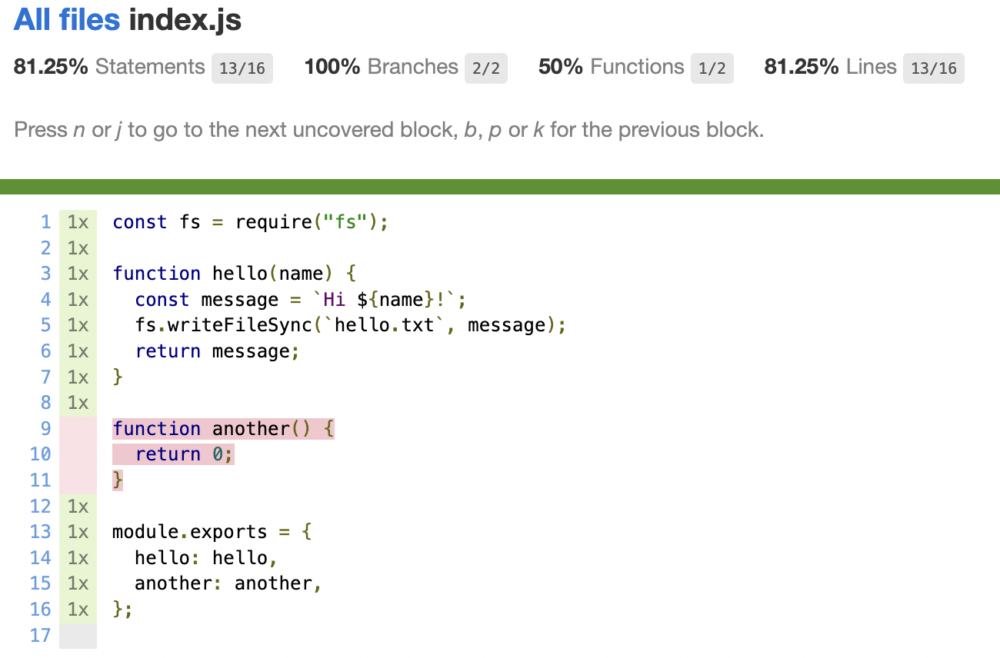

# Example JavaScript Library Part 2

This is a continuation of the example series, in which unit testing and code coverage is added to the project.

Prerequisites

- Git Setup: https://github.com/jvalentino/setup-git
- Part 1: https://github.com/jvalentino/example-js-npm-lib-1

# Test

It starts with using the following plugins to make a unit testing framework:

- c8 - coverage gate
- chai - testing
- mocha - framework
- Sinon - mocking

...where we then can write a basic test:

test/index-test.js

```javascript
// testing
const expect = require("chai").expect;
const sinon = require('sinon');
const subject = require("../src/index");

// mocks
const fs = require("fs");
let fsMock = null;

describe("index.js", function() {
  
    beforeEach(() => {
        fsMock = sinon.mock(fs);
    });
  
    afterEach(() => {
        sinon.restore();   
        fsMock.restore();
    });

    it("test hello", function() {
        // given
        const name = "John";

        // and: fs.writeFileSync(`hello.txt`, message);
        fsMock.expects("writeFileSync").once()
            .withExactArgs("hello.txt", "Hi John!");

        // when
        const result = subject.hello(name);

        // then
        fsMock.verify();

        expect(result).equals("Hi John!");
    });

});
```

The following command can then be used to exectute the testing:

```bash
$ npm run test

> example-js-npm-lib-2@1.0.0 test
> npx c8 mocha --reporter spec test --recursive

  index.js
    ✔ test hello


  1 passing (4ms)

----------|---------|----------|---------|---------|-------------------
File      | % Stmts | % Branch | % Funcs | % Lines | Uncovered Line #s 
----------|---------|----------|---------|---------|-------------------
All files |   81.25 |      100 |      50 |   81.25 |                   
 index.js |   81.25 |      100 |      50 |   81.25 | 9-11              
----------|---------|----------|---------|---------|-------------------
```

It also produces a report at coverage/index.html:



# Verify

You can then run this command to assert coverage remains above a threshold:

```bash
$ npm run verify

> example-js-npm-lib-2@1.0.0 verify
> npx c8 check-coverage --lines 80
```

In this case, if it drops below 80%, it will return a non-zero exit code and fail whatever build system is calling it.